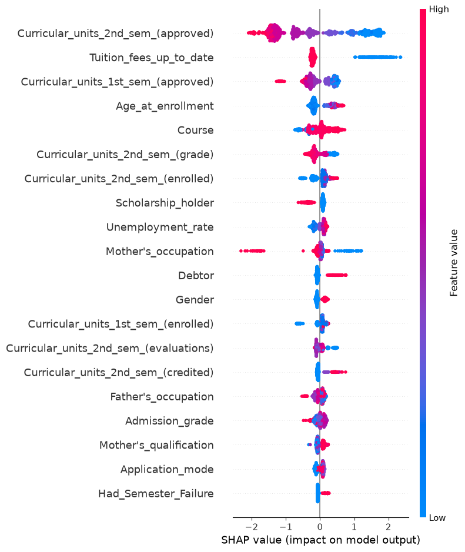
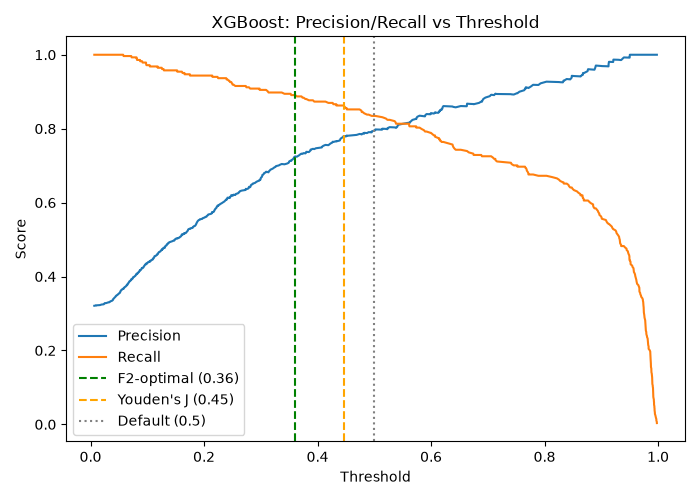
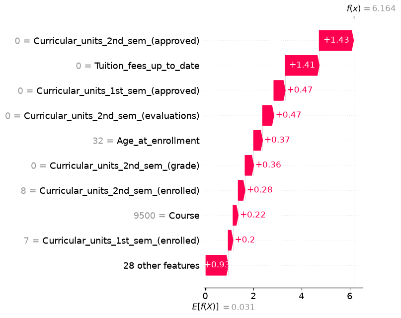
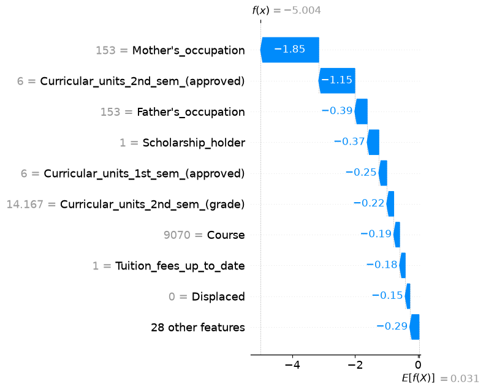

# 🎓 Student AI Dropout Risk System

An end-to-end machine learning system that predicts a student's probability of dropping out, and explains *why*, so academic advisors can identify and support at-risk students before it's too late.

**🔗 Live Demo:** https://student-dropout-risks.streamlit.app/
**📂 Repository:** https://github.com/Rohin189/Student_AI_Dropout

---

## Problem

Universities collect rich academic, financial, and demographic data on students, but that data rarely gets turned into an early-warning system. Advisors typically find out a student is struggling only after grades have already slipped for a semester or more — often too late for meaningful intervention.

This project builds a system that predicts dropout risk *and* explains the prediction in plain terms, using the [UCI Predict Students' Dropout and Academic Success dataset](https://archive.ics.uci.edu/dataset/697/predict+students+dropout+and+academic+success) (4,424 students, 37 features).

## Approach

The system was built as a 10-day, end-to-end pipeline rather than a single notebook:

1. **Data Engineering** — dual-track preprocessing: a raw track for tree-based models (XGBoost, Random Forest) and a selectively-scaled track (StandardScaler applied only to continuous features) for Logistic Regression, keeping categorical/binary columns untouched.
2. **Exploratory Data Analysis** — data quality audit, class balance check, outlier diagnostics, correlation analysis, and Mutual Information ranking to identify real predictive signal before any modeling.
3. **Feature Engineering & Baselines** — engineered features tested empirically (not just added on assumption), four baseline models trained and compared (Logistic Regression, Decision Tree, Random Forest, XGBoost).
4. **Hyperparameter Tuning** — Bayesian optimization via Optuna (75 trials each) for Random Forest and XGBoost, using stratified 5-fold CV on ROC-AUC.
5. **Threshold Optimization** — moved beyond the default 0.5 cutoff, comparing Youden's J and F2-optimal thresholds against the actual cost tradeoff between missed at-risk students (false negatives) and unnecessary advisor check-ins (false positives).
6. **Explainable AI (SHAP)** — TreeExplainer integrated for both global feature importance and per-student local explanations, so predictions come with a "why," not just a number.
7. **Interactive Dashboard** — a 5-tab Streamlit app: Home, Predict Student, Explain Prediction, Model Performance, and Upload CSV (batch scoring).
8. **Deployment** — live on Streamlit Community Cloud.

## Key Decisions

Several decisions in this project were made empirically rather than by default, and are worth calling out specifically:

- **Dual-track preprocessing over blanket scaling** — avoids corrupting categorical features while still giving Logistic Regression properly scaled continuous inputs.
- **Engineered feature validated, not assumed** — a `Had_Semester_Failure` flag was tested with a before/after comparison; it added no measurable lift (the signal was already captured by approved-unit counts, confirmed by the Day 2 Mutual Information ranking) but was kept for its interpretability value in the SHAP dashboard.
- **Optuna over GridSearchCV** — Bayesian optimization was chosen to search continuous hyperparameter ranges efficiently rather than a hand-picked discrete grid.
- **Correcting for overfitting found via CV, not assumed** — Optuna's top Random Forest trial (`min_samples_leaf=1`) showed a large train/test ROC-AUC gap (0.068); a follow-up sweep found `min_samples_leaf=3` matched or exceeded test performance with a smaller gap, and was selected instead of the raw "best" CV trial.
- **XGBoost selected over Random Forest** for a consistently better precision-recall tradeoff at every threshold, not just a marginally higher AUC.
- **Youden's J over F2-optimal for the final threshold** — F2-optimal maximized recall but at a steep precision cost; Youden's J improved recall over the default threshold at near-zero precision cost, a stronger tradeoff given the assumed intervention cost.
- **SHAP cross-validated against Day 2's Mutual Information ranking** — the model's top feature drivers matched the independent EDA analysis, which is real evidence the model learned genuine signal rather than a spurious pattern.
- **Caught and fixed a silent data-integrity bug** in the CSV upload tab — a semicolon-delimited file parsed with a comma separator failed silently (not with an error), scoring every row against 100% default values while still reporting "success." Fixed by validating the parsed column count and adding a hard-stop if the schema match rate falls below 50%.
- **Caught and fixed a Windows-vs-Linux deployment issue** — a `pip freeze`-generated `requirements.txt` included Windows-only packages (e.g. `pywinpty`) that failed to install on Streamlit Cloud's Linux runtime; fixed by trimming the file to only the packages actually imported at runtime.

## Results

**Baseline model comparison (Day 3):**

| Model | ROC-AUC |
|---|---|
| Random Forest | 0.9305 |
| Logistic Regression | 0.9274 |
| XGBoost | 0.9234 |
| Decision Tree | 0.7745 |

**Tuned & final model comparison (Day 4-6, post path-fix):**

| Model | Test ROC-AUC | Train ROC-AUC | Train-Test Gap |
|---|---|---|---|
| **XGBoost (selected)** | **0.9354** | 0.9633 | 0.0279 |
| Random Forest | 0.9318 | 0.9951 | 0.0633 |

**Production configuration:** XGBoost, decision threshold = 0.446 (Youden's J)

### Global feature importance (SHAP)



Top drivers — `Curricular_units_2nd_sem_(approved)`, `Tuition_fees_up_to_date`, `Curricular_units_1st_sem_(approved)` — match the independent Mutual Information ranking from Day 2's EDA.

### Precision/Recall vs. Threshold — XGBoost



### Example explanations

| High-risk student | Low-risk student |
|---|---|
|  |  |

## Dashboard

Five tabs, each backed by the pipeline above:

- **🏠 Home** — system overview, headline metrics, model selection rationale
- **📊 Predict Student** — form-based single-student risk scoring
- **🔍 Explain Prediction** — live SHAP waterfall for the most recent prediction
- **📈 Model Performance** — full model comparison table, global SHAP importance, threshold curve
- **📂 Upload CSV** — batch scoring for an entire cohort, with schema validation and a downloadable results file

## How to Run Locally

```bash
git clone https://github.com/Rohin189/Student_AI_Dropout.git
cd Student-AI-Dropout-Risk-System

conda create -n student_dropout_env python=3.11
conda activate student_dropout_env
pip install -r requirements.txt

# Reproduce the pipeline from scratch (optional — processed data/models are already committed)
python src/preprocess.py
python src/train.py
python src/tune.py
python src/evaluate_tuned.py
python src/threshold.py
python src/explain.py

# Launch the dashboard
streamlit run app.py
```

## Tech Stack

Python 3.11 · pandas · scikit-learn · XGBoost · Optuna · SHAP · Streamlit · matplotlib

## Project Structure

```
Student-AI-Dropout-Risk-System/
├── app.py
├── data/
│   ├── raw/student_data.csv
│   └── processed/
├── models/
│   ├── xgb_tuned.pkl, rf_tuned.pkl, scaler.pkl
│   ├── shap_explainer.pkl, shap_values_test.npy
│   ├── best_params.json, decision_config.json
├── results/
│   ├── baseline_results.csv, tuned_results.csv
│   ├── shap_summary.png
│   ├── shap_waterfall_high_risk_example.png, shap_waterfall_low_risk_example.png
│   ├── random_forest_threshold_curve.png, xgboost_threshold_curve.png
├── notebooks/EDA.ipynb
└── src/
    ├── preprocess.py, train.py, tune.py
    ├── evaluate_tuned.py, threshold.py
    ├── explain.py, predict.py
```

## Author

Rohin A. Hegde